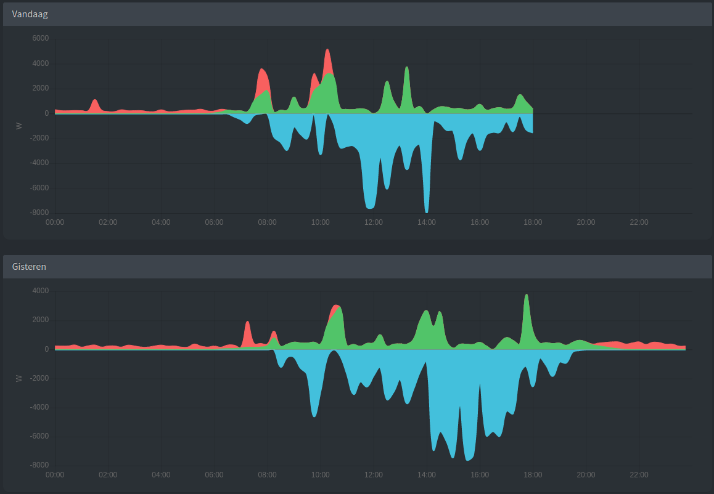

# ModBus-TCP proxy for Dobiss-NXT

[](https://github.com/clouTrix/dobiss-modbus-tcp/actions/workflows/build.yml)
[](https://opensource.org/licenses/MIT)

## Dobiss

Dobiss-NXT has built in support for SMA and Solaredge inverters to query energy production directly from the PV converter.
Unfortunately EnvoyS is not supported, but no panic, as EnvoyS has an API to query statistics its always possible to
hook it up through some proxy service.

In comes the `Dobiss-Modbus-TCP-Proxy`.

What this project does is mimic an SMA converter towards Dobiss-NXT so that PV production/consumption stats
can be correctly visualized in the Dobiss-NXT UI, coming from an EnvoyS converter.


Simply configure the IP address and listening port of the `Dobiss-Modbus-TCP-Proxy` into the Dobiss-NXT _Energy Configuration_
panel and you're ready to go.

### Modbus-TCP SMA

The table below gives an overview of the Modbus registers that are being read by Dobiss-NXT

| address | description                                      | size | type | dec. |R/W |
|---------|--------------------------------------------------|------|------|------|----|
| 30775   | Current active power on all line conductors (W)  | 2    | S32  | FIX0 | RO |
| 30529   | Total yield (Wh) [E-Total]                       | 2    | U32  | FIX0 | RO |

## EnvoyS

The idea is thus to map the registers depicted above to the correct stats coming from EnvoyS.
EnvoyS has a bunch of APIs to query stuff, but the one that gives us the most useful data is `/ivp/meters/readings`.

### /ivp/meters

The `/ivp/meters` endpoint can be used to get the `eid` for the production statistics queried through `/ivp/meters/readings`.
It's the `eid` of the `production` measurement type that needs to be used to filter on the `/ivp/meters/readings` data to get
the proper production stats Dobiss-NXT expects.

``` json
[
    {
        "eid": 123456789,
        "measurementType": "production",
    }
]
```

### /ivp/meters/readings

With the `eid` for production, the `/ivp/meters/readings` endpoint from EnvoyS is called to fetch all meter readings.
They are then filtered on `eid == (the eid for production)`.
The only readings of interest are `actEnergyDlvd` and `activePower` as they perfectly contain the data that Dobiss-NXT expects.

``` json
[
    {
        "eid"           : 123456789,
        "actEnergyDlvd" : 999999.999           // total yield (Wh) [lifetime]
        "activePower"   : 999.999,             // current production (W)
        "channels"      : [...]
    }
]
```

#### actEnergyDlvd
The **total production** of the PV installation up till now in Wh.
Dobiss-NXT uses this to populate the historical graphs in the UI.

#### activePower
The **current production** of the PV installation in Watts.  
Used in the Dobiss-NXT UI to visualize the current status and previous 24 hour graphs (the green values/bars in the graphs below).

|                                           |
|-------------------------------------------|
|   |
|       |
|  |

## Add other inverter types

This project is created to hook up the EnvoyS (Enlighten) inverters on to the Dobiss-NXT, but can easily be extended
to support other brands, as long as they have an HTTP API that can be used to query their metrics.

> Have a look at the implementation for [EnvoyS](./src/main/scala/cloutrix/energy/envoy/EnvoyDataProvider.scala) as example how such implementation could look like.

**But basically it's following these steps**:

- create your own `DataProvider`
  ```
  class MyDataProvider(config: Config) extends HttpDataPoller with DataProviderCache
  ```
- register the HTTP endpoints to be scraped on your inverter(s)
  ```
  register("my-endpoint-id" -> ("http/path/to/query", myCodec))
  ```
- implement a _Codec_ to transform the HTTP received `String` into your own data format  
- implement `onData` to process/cache the queried metrics
  ```
  override def onData(id: String, data: Any): Unit = {
    // your logic goes here
    // the type of 'data' will be whatever type your codec (for that endpoint id) returns
    // extract 'current production' and 'total production' from your data
    // and cache it for delivery through the ModBus pipeline when Dobiss-NXT would issue a query for it.
    // > cache(currentProduction = ..., totalProduction = ...)
  }
  ```
- configure your DataProvider (in [application.conf](src/test/resources/application.conf))
  ```
  plugins {
    MyInverter = ${mine}
  }
  
  mine {
    class = ... // full class path/name of your DataProvider implementation
    config {
        ... // whatever config is needed to be fed to your DataProvider
            // host-ip and port are probably already the 2 mandatory ones.
    }
  }
  ```

# Dobiss-Modbus-TCP-Proxy

The project is written in Scala (2.13) and can easily be containerized to run on a NAS, Raspberry-PI, or any other platform.

## Requirements

|            |                                                                 |
|------------|-----------------------------------------------------------------|
| **memory** | 100 MiB                                                         |
| **CPU**    | 1 core is sufficient <br> it hardly uses any compute resources. |
| **disk**   | _not used_                                                      |
| **network**| approximately 5K per minute, so should be hardly noticable      | 

## Build

### Compile and Test
```
sbt clean compile coverage test coverageReport
```
Coverage HTML file is generated in `./target/scala-2.13/scoverage-report/index.html`

### Create container
```
sbt clean docker:publishLocal
```

### Create assembly
```
sbt clean assembly
```
The Uber-JAR is created in `./target/scala-2.13/DobissModbusProxy-assembly-<version>.jar`

To run the application from this JAR file: `java -jar DobissModbusProxy-assembly-<version>.jar`

## Configuration
```
modbus {
  tcp.port  = 1502  // listening port of the proxy service
                    // port as used in the Dobiss-NXT configuration
}

poll.interval = "1 minute"

plugins {
    EnvoyS {
      class = cloutrix.energy.envoy.EnvoyDataProvider
      config.host = x.x.x.x   // IP address of EnvoyS
      config.port = 80        // HTTP listening port of EnvoyS
    }
}
```

Following environment variables can be used to configure the application:

| env                           | default | description                                                                                                                                   |
|-------------------------------|---------|-----------------------------------------------------------------------------------------------------------------------------------------------|
| `MODBUS_TCP_PORT`             | 1502    | listening port of the proxy service                                                                                                           |
| `PLUGIN_<name>`               | -       | to define a data-provider through environment variables.<br> `PLUGIN_<name>=[envoy!saj]@<ip-address>[:<port>]`                                |
| `OFFSET_TOTAL_PRODUCTION`     | 0       | the correction value (in **Wh**) that needs to be added to the total production value coming from the inverters (can be positive or negative) |
| `OFFSET_IMMEDIATE_PRODUCTION` | 0       | the correction value (in **W**) that needs to be added to the immediate production value coming from the inverters (can be positive or negative)                           |

## TODOs
 - better (inline) code comments
 - HTTP authentication
 - metrics (prometheus)
 - Kubernetes deployment (K3S)
 - easy way to push custom configuration to the docker container
 - GitOps build/test pipeline
---
